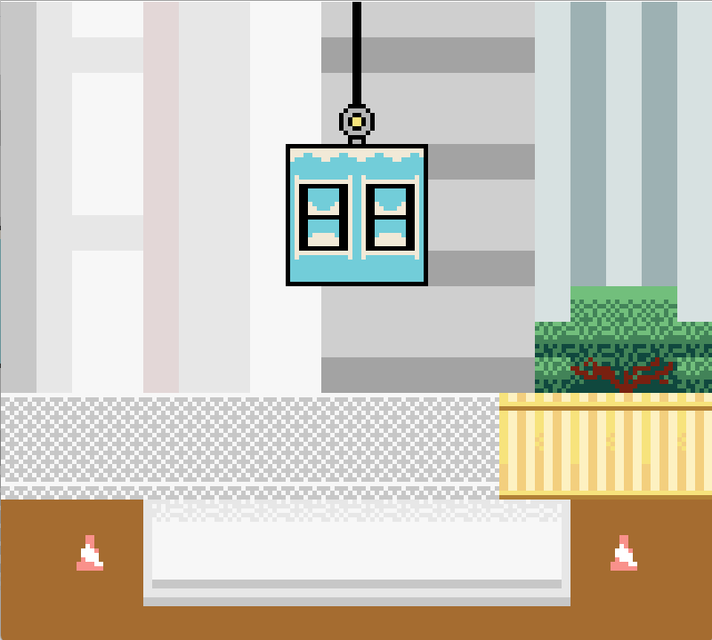

# NGBC-game

The game is called "Block Builder" and is played on the **Nintendo Game Boy Color**. The objective of the game is to build houses out of blocks and place them in such a way that they do not fall. The player must use strategy and precision to stack the blocks correctly, and as the player progresses through the levels, the difficulty increases. The game features colorful graphics and various levels to keep the player engaged.

## Images
### Last build


### Programming language, libraries and frameworks: 
* C
* [GBDK](https://github.com/gbdk-2020/gbdk-2020)

### How to use
1. Clone the repository to local storage.
```sh
git clone https://github.com/Artic67/NGBC-game.git
```
2. Download last full [GBDK release](https://github.com/gbdk-2020/gbdk-2020/releases)
3. Unzip *"gbdk"* folder to your *path*:
> Example:
```
C:\gbdk
```

4. Run **make.bat** file with your *path* argument:
> Example:
```sh
.\make.bat c:/gbdk
```
5. Download any Game Boy Emulator (I prefer [**Emulicious**](https://emulicious.net/downloads/))
6. Run ***build/main.gb*** with Game Boy Emulator
